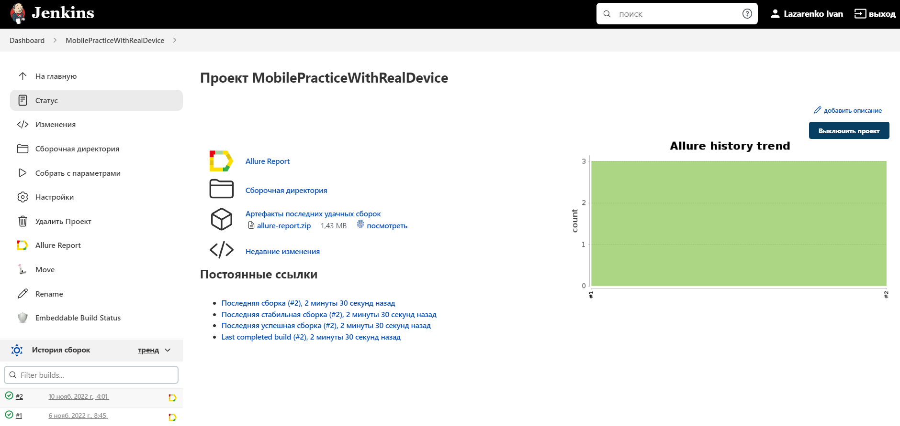
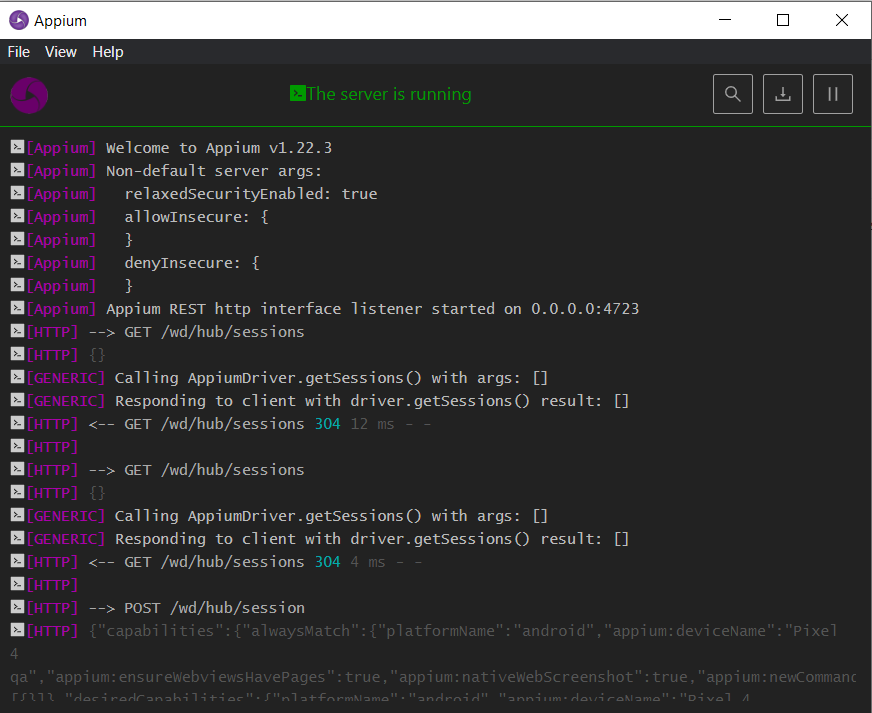
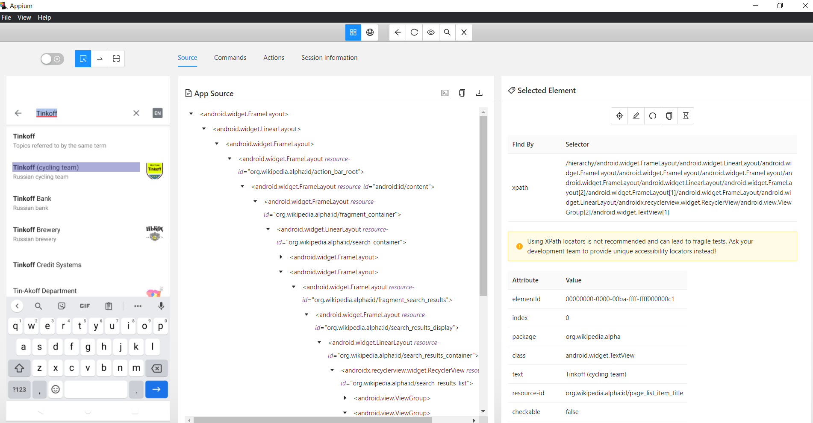
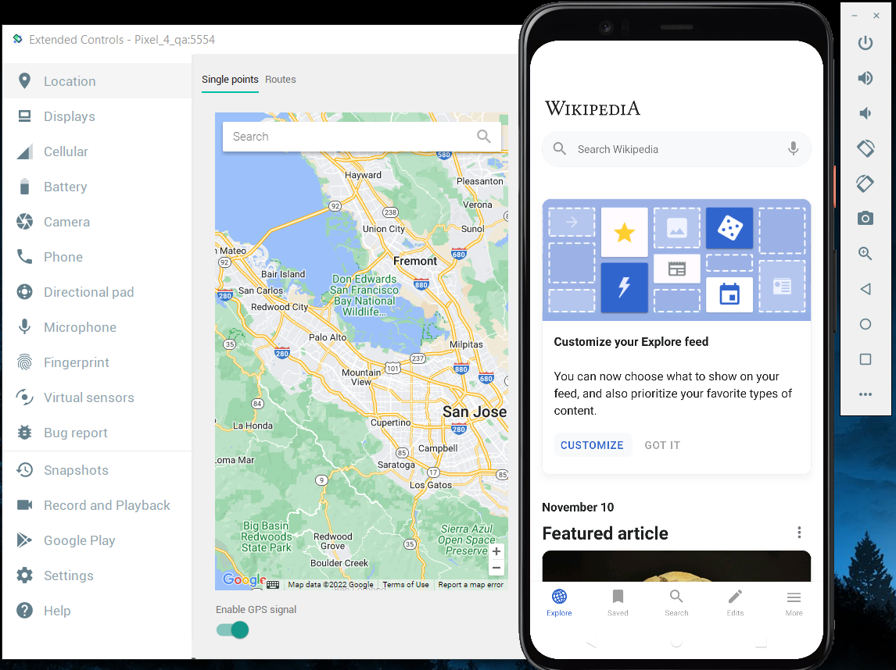
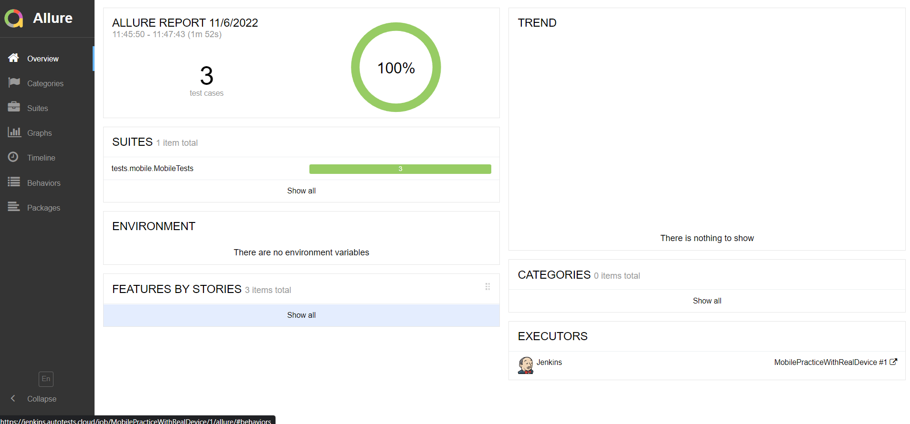
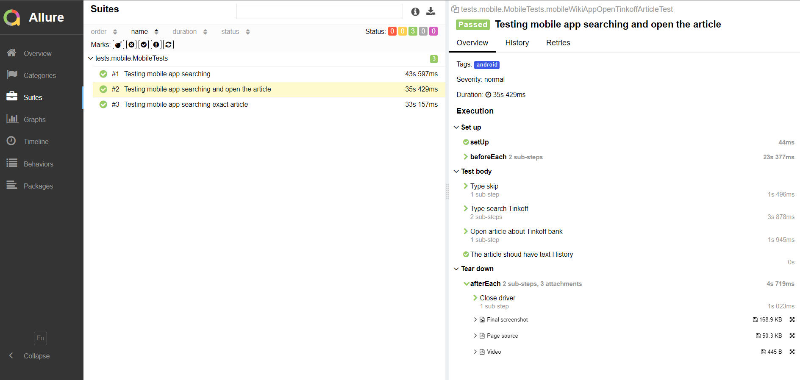
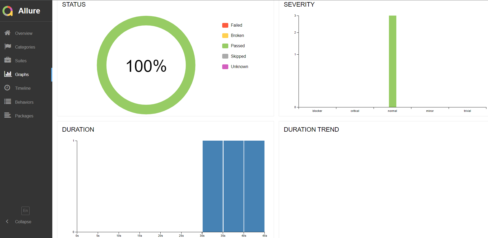
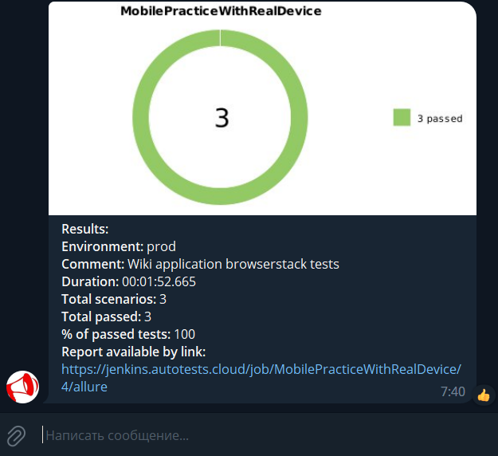
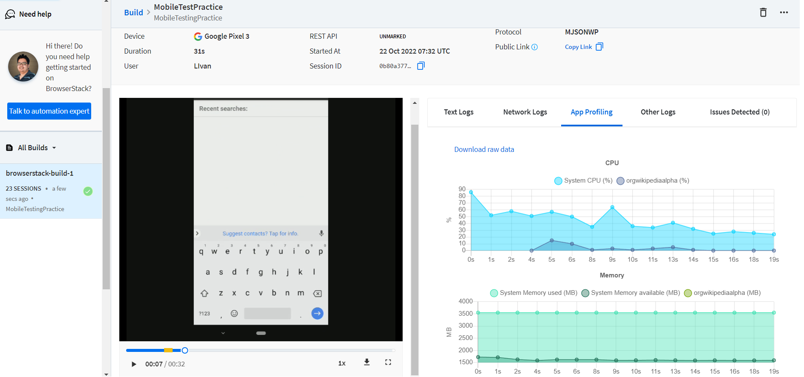
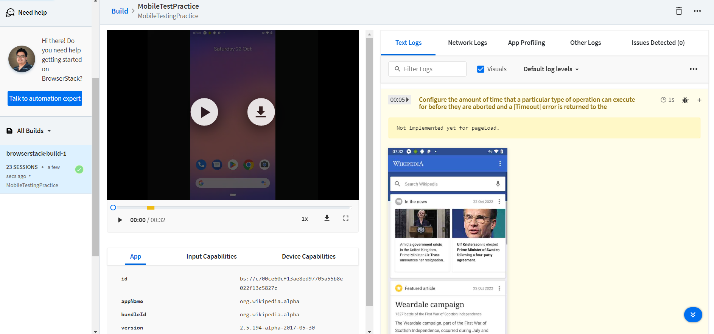

<h2 align="center">Automated tests for the Wikipedia mobile app <a target="_blank" href="https://www.wikipedia.org/"></a> </h2>

<p align="center">

</p>

<a name="up"></a>

# :green_book: *Content*

+ [Technology stack](#Technology)
+ [Test cases](#TestCases)
+ [Jenkins build](#Jenkins)
+ [Launch from the terminal](#SystemProperty)
+ [Appium](#Appium)
+ [Android Studio. Mobile device emulator](#AndroidStudio)
+ [Allure Report integration](#AllureReport)
+ [Notifications on Telegram](#Telegram)
+ [Video examples from Browserstack](#Browserstack)


<h1 align="left">
<a name="Technology"><i>Technology stack</i></a>
</h1>


<p align="center">  
<a href="https://www.jetbrains.com/idea/"></a>  
<a href="https://www.java.com/"></a>  
<a href="https://github.com/"></a>  
<a href="https://junit.org/junit5/"></a>  
<a href="https://gradle.org/"></a>  
<a href="https://selenide.org/"></a>  
<a href="https://github.com/allure-framework/allure2"></a> 
<a href="https://github.com/appium/appium-inspector/raw/main/docs/icon.png"></a>  
<a href="https://avatars.githubusercontent.com/u/3221291?s=200&v=4"></a>  
<a href="https://cdn.worldvectorlogo.com/logos/android-studio-1.svg"></a>  
<a href="https://www.jenkins.io/"></a>  
</p>


<h1 align="left">
<a name="TestCases"><i>Test cases</i></a>
</h1>

- :white_check_mark: Check search functional
- :white_check_mark: Check search of exact article
- :white_check_mark: Check exact article header

<h1 align="left">
  <a name="Jenkins"><i>Jenkins build</i></a>
</h1>

<a target="_blank" href="https://jenkins.autotests.cloud/job/MobilePracticeWithRealDevice/1/">**build link**</a>
<p align="center">  
<a href="https://jenkins.autotests.cloud/job/qa_guru_diplom_Mobile_tests/"></a>  
</p>

<h1 align="left">
<a name="SystemProperty"><i>Launch from the terminal</i></a>
</h1>


***Local run:***

```bash  
gradle clean androidTests -DdeviceHost=${DEVICE_HOST}
```

***Remote run with Jenkins:***

```bash  
clean androidTests -DdeviceHost=${DEVICE_HOST}
```
> `${DEVICE_HOST}` - test run device [ *browserstack* , *emulator* , *real*  ]

<a id="appium"></a>
## Appium</a>

> *Appium is an open source test automation framework for use with native, hybrid and mobile web apps.*

### *Appium Server*


### *Appium Inspector*


<a id="AndroidStudio"></a>
## AndroidStudio</a>

> *Mobile emulator*



<h1 align="left">
  <a name="AllureReport"><i>Allure Report integration</i></a>
</h1>

<a target="_blank" href="https://jenkins.autotests.cloud/job/MobilePracticeWithRealDevice/1/allure/">**Allure report link**</a>
<p align="center">

### *Main page*

<p align="center">  
  
</p>  

### *Test cases*

<p align="center">  
  
</p>

### *Graphs*

 <p align="center">  
  
</p>

<h1 align="left">
 <a name="Telegram"><i>Telegram notifications with Alert bot</i></a>
</h1>

<p align="center">  
  
</p>

<h1 align="left">
 <a name="Browserstack"><i>Test run on Browserstack</i></a>
</h1>

### *Video*

<p align="center"> 
   
</p>

### *Statistics*

 <p align="center">  
  
</p>

 <p align="center">  
  
</p>

[Up ⬆](#up)


